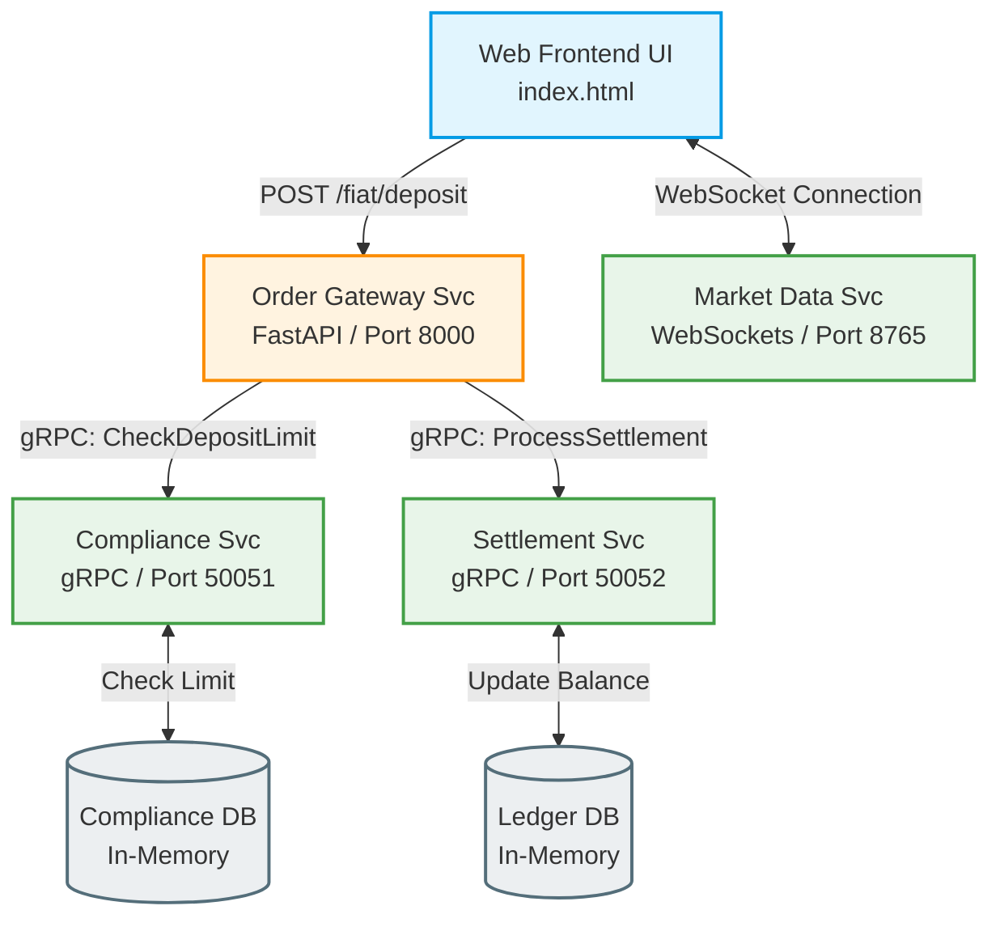

# Distributed-Exchange-Sandbox (DES)

Distributed-Exchange-Sandbox (DES) 是一個模擬分散式資產交易系統核心業務的輕量測試沙盒。本專案能讓 QA 工程師在單機環境下，模擬完整的 Fiat 入金、合規限額檢查（KYC）、高併發限流、以及在極端惡劣的 Weak Network 環境下（高 Latency、高 Packet Loss），系統是否能保證「交易不漏、不重複扣款、前端優雅降級」等金融級核心測試。

本專案採用 **Monorepo** 架構，由 **「Microservices 架構開發 (src/)」** 與 **「多維度自動化測試套件 (tests/)」** 兩大核心板塊組成，完整展示了測試開發工程師 (SDET) 從系統被測端（System Under Test）到測試端點對點的品質保障實踐。

---

## 🎯 專案動機與期望目標 (Motivation & Project Goals)

在交易與資金清算（Fiat On/Off-Ramp）場景中，系統的容錯性、數據一致性與高併發承載力是核心命題。本沙盒旨在達成以下核心技術目標：

1. **業務流程模擬 (Business Workflow Simulation)**：實現用戶從前端發起 Fiat 充值（Deposit），觸發後台 Compliance Service 校驗限額與 KYC 狀態，再由 Settlement Service 完成帳戶變更的完整鏈路。
2. **Weak Network 容錯驗證**：在前端與 Gateway、Gateway 與微服務之間注入網路 Latency 與 Packet Loss，撰寫測試代碼驗證冪等性（Idempotency Token，防止因 Timeout 重試導致的重複扣款）。
3. **高併發性能極限 (High-Concurrency Benchmarking)**：使用 k6 對 API Gateway 進行壓力測試，確認合規檢查在高併發下是否會造成死鎖（Deadlock），並量測系統的響應性能與 Latency 分佈。

---

## 🏗️ 系統架構與數據流向 (System Architecture & Data Flow)

本沙盒包含四個持續運行的微服務引擎。API Gateway 作為唯一外部入口，負責調度內部的多個獨立服務：



每日合規充值限額限制公式：當充值金額符合以下公式時，合規服務予以核准；否則拒絕交易：

amount≤1000.0

複式記賬餘額更新公式：

new_balance=current_balance+amount


## 📂 檔案目錄結構 (Directory Tree)
我們採用清晰的分層目錄結構，將「開發原始碼 (src/)」與「自動化測試套件 (tests/)」完全解耦，以展現標準的軟體品質工程管理學：

```text
des/                             # 根目錄 (專案名稱)
│
├── des-venv/                    # Python 虛擬環境 (Git 自動忽略)
│
├── src/                         # 【第一部分：應用程式原始碼 (開發端)】
│   ├── proto/                   # gRPC 協定定義
│   │   ├── exchange.proto       # 定義 KYC 合規與記賬結算 RPC 接口
│   │   ├── exchange_pb2.py      # 自動生成的 Protobuf 序列化代碼
│   │   └── exchange_pb2_grpc.py # 自動生成的 gRPC 連接代碼
│   │
│   ├── market_data_svc.py       # WebSocket 異步行情廣播引擎 (轉發真實 BTC 價格)
│   ├── order_gateway_svc.py     # FastAPI REST API 閘道引擎 (內建冪等性控制)
│   ├── compliance_svc.py        # gRPC 合規微服務引擎 (KYC 審查與累計限額)
│   ├── settlement_svc.py        # gRPC 結算微服務引擎 (帳戶資產帳本記賬)
│   │
│   └── frontend/
│       └── index.html           # 前端 Web UI (內建「弱網模擬與丟包」測試面板)
│
├── tests/                       # 【第二部分：自動化與性能測試套件 (測試端 - 重頭戲)】
│   ├── integration/
│   │   ├── test_api_gateway.py  # pytest: 測試 API Gateway 與後台 gRPC 微服務的全鏈路整合
│   │   └── test_idempotency.py  # pytest: 測試弱網不穩定重試時，防重複扣款的冪等性功能
│   │
│   ├── e2e/
│   │   └── test_weak_network.py # Selenium: 自動控制瀏覽器，驗證弱網下 UI 的 Loading 與 Timeout 機制
│   │
│   └── performance/
│       └── load_test.js         # k6: 模擬高併發法幣充值，量測系統性能百分位數與有無併發死鎖
│
├── requirements.txt             # 專案套件相依性清單
├── .gitignore                   # Git 忽略檔案 (排除編譯快取與虛擬環境)
└── README.md                    # 專案啟動與測試操作手冊 (本文件)

```

## 🛠️ 技術棧與相依性 (Tech Stack & Dependencies)
- 開發語言：Python 3.10+ (完全相容 macOS Zsh / Linux 跨平台環境)
- 開發框架：
    - FastAPI (REST API Gateway) + Uvicorn (高性能 Web 伺服器)
    - gRPC & Protocol Buffers (高效能微服務跨進程 RPC 通訊)
    - websockets (基於 Python Async 的全雙工即時行情廣播)
- 測試框架 (SDET Core)：
    - pytest (單元與全鏈路接口整合測試)
    - Selenium WebDriver (Web UI 端到端自動化測試)
    - k6 (基於 Go 核心的高性能、代碼化負載測試工具)


## 🔌 組件與介面規範 (Interface Specifications)
1. API Gateway 外部接口 (HTTP REST)
- 入金充值：POST /fiat/deposit
    - Header：Idempotency-Key: <unique_string> (必填，用於防止重複加款)
    - Request Body:
        ```
        {
        "user_id": "user123",
        "amount": 100.0,
        "currency": "USD"
        }
        ```

    - Response (200 OK):
        ```
        {
        "success": true,
        "transaction_id": "fb3b2f37-417f-4dff-89ff-179c18b77eac",
        "new_balance": 250.0
        }
        ```

2. 內部微服務 gRPC 接口
- 合規校驗服務：ComplianceService.CheckDepositLimit
    - 協議：Protocol Buffers (連接埠 50051)
- 資產結算服務：SettlementService.ProcessSettlement
    - 協議：Protocol Buffers (連接埠 50052)

## 🔒 強健性與優化機制 (Robustness & Optimization)
本專案實作了多項金融級別的後台防禦性設計，這也是自動化測試要重點防護的對象：

1. 分散式冪等性鎖定 (Idempotency Locking)： Gateway 在記憶體中維護了一個交易狀態雜湊表。當收到 PENDING 狀態的 Key 時，會回傳 409 Conflict，避免併發重複請求；當收到 COMPLETED 狀態的 Key 時，會直接回傳快取的歷史回應，拒絕二次加款。
2. 前端優雅降級 (Graceful Degradation)： 當網絡不穩導致 WebSocket 中斷時，前端會顯示「連線已中斷」，但仍允許使用者手動進行入金操作，確保核心交易功能的可用性。
3. 邊界防禦與異常隔離 (Fault Isolation)： 若後台的 gRPC 微服務因系統異常崩潰，API Gateway 會在 try-except 塊中捕獲錯誤，釋放已鎖定的 Idempotency-Key（避免卡死用戶後續的重試），並安全地向客戶端回傳 500 Internal Server Error。


## 🚀 啟動與使用說明 (Usage Guide)
為了使本系統順利運作，請嚴格按照以下指南在本地端進行編譯與引擎啟動。

1. **環境準備與套件安裝**

   打開終端機（Terminal）並切換至專案根目錄。

   ```bash
   source des-venv/bin/activate
   pip install --upgrade pip setuptools wheel
   pip install -r requirements.txt
   ```

2. **協定編譯**

   在專案根目錄下執行以下一次性協定編譯指令，以產生 Python 連接代碼：

   ```bash
   python -m grpc_tools.protoc -Isrc/proto --python_out=src --grpc_python_out=src src/proto/exchange.proto
   ```

   執行後，系統會在 `src/` 下自動生成 `exchange_pb2.py` 與 `exchange_pb2_grpc.py` 兩個檔案。

3. **後台服務引擎並行啟動**

   在 VS Code 中開啟 4 個不同的 Terminal 分頁（皆需手動執行 `source des-venv/bin/activate` 啟用環境），並依序啟動以下服務：

   - 分頁 1：Compliance (合規服務 - Port 50051)

     ```bash
     python src/compliance_svc.py
     ```

   - 分頁 2：Settlement (結算服務 - Port 50052)

     ```bash
     python src/settlement_svc.py
     ```

   - 分頁 3：Market Data (行情廣播服務 - Port 8765)
     注意：此服務會連線至公開行情流，請確保本機已連網。

     ```bash
     python src/market_data_svc.py
     ```

   - 分頁 4：Gateway (REST 網關大腦 - Port 8000)

     ```bash
     python -m uvicorn src.order_gateway_svc:app --reload --port 8000
     ```

4. **載入前端介面**

   在 VS Code 檔案總管中，對著 `src/frontend/index.html` 按滑鼠右鍵。

   選擇「Open with Live Server」（預設伺服於 Port 5500）。

   網頁開啟後，最新價格即會開始即時同步跳動。

## 🧪 測試套件實作與驗證指南 (Testing Suite - 重頭戲)

這是本沙盒作為 SDET 專案的「重頭戲」，以下是各個自動化測試套件的設計思路與執行指令：

1. **整合測試套件 (Integration Testing)**

   檔案位置：`tests/integration/`

   測試邏輯：

   - `test_api_gateway.py`：使用 Python 的 `requests`（或 FastAPI 的 `TestClient`），繞過前端直接發送 HTTP 請求給閘道，並驗證其內部是否能順利連動合規與結算 gRPC 伺服器，斷言 HTTP 狀態碼與 JSON 返回結構。
   - `test_idempotency.py`：使用 `pytest` 模擬弱網重試，連續發送兩個攜帶相同 `Idempotency-Key` 的交易請求。斷言第二次請求會成功命中緩存，且結算服務的 Ledger 僅有一次加款記錄。

   ```bash
   pytest tests/integration/
   ```

2. **端到端自動化測試套件 (E2E Testing)**

   檔案位置：`tests/e2e/test_weak_network.py`

   測試邏輯：使用 Selenium 啟動 `chromedriver`，模擬用戶自動打開網頁、輸入金額、點擊按鈕。測試重點為：勾選「弱網模擬」後，腳本會自動捕獲超時異常，確認畫面上是否有正確渲染 Loading 狀態與紅色錯誤，並自動點擊「使用相同 Key 重試」按鈕，最後斷言交易成功訊息。

   ```bash
   pytest tests/e2e/
   ```

3. **高併發性能測試套件 (Performance Testing)**

   檔案位置：`tests/performance/load_test.js`

   測試邏輯：使用 `k6` 建立負載測試。模擬 100 個虛擬用戶在 15 秒內對 `/fiat/deposit` 發送併發交易。我們會在腳本中動態產生相同的 `Idempotency-Key`，並藉此驗證在高併發壓力下，合規與結算服務是否會因為線程競爭（Race Conditions）或數據庫鎖定而發生死鎖（Deadlock），並計算對應的 `p50`、`p90`、`p99` 響應時間百分位數。

   ```bash
   k6 run tests/performance/load_test.js
   ```

## 🕵️ 手動驗證與 QA 測試指南 (Manual QA Testing Scenarios)

在進入自動化測試開發前，QA 工程師需完成以下核心業務的手動驗證：

### Test Case 1: 正常法幣充值 (Normal Fiat Deposit)
*   **前置條件**：確認「弱網模擬」**未勾選**。
*   **測試步驟**：在入金金額輸入 `100`，點擊「確認入金」。
*   **預期結果**：前端顯示入金成功，最新餘額更新。後台 `Settlement Svc` 印出 `Ledger updated for user123: 150.0 -> 250.0`，完成複式記帳。

### Test Case 2: 合規上限攔截測試 (Compliance Limit Block)
*   **前置條件**：確認「弱網模擬」**未勾選**。
*   **測試步驟**：在入金金額輸入 `1500`（大於 $1000 USD 限額），點擊「確認入金」。
*   **預期結果**：前端顯示 `交易遭合規拒絕: Compliance check failed`。後台 `Compliance Svc` 拒絕請求，且 `Settlement Svc` **沒有**任何結算日誌，證明風險被成功隔離。

### Test Case 3: 弱網丟包與冪等性重試 (Weak Network & Idempotency Retry)
*   **前置條件**：**勾選**「啟用弱網模擬」。
*   **測試步驟**：輸入金額 `200`，點擊「確認入金」。等待 3 秒若觸發 20% 丟包率，前端報錯並顯示「使用相同 Idempotency-Key 重試」按鈕。點擊該重試按鈕。
*   **預期結果**：前端顯示交易成功。後台 `API Gateway` 印出 `Idempotency hit for key... Returning cached response.`，且 `Settlement Svc` 僅執行一次餘額更新，成功防止重複扣款。

### Test Case 4: 即時行情流觀測 (Market Data Stream)
*   **預期結果**：放著網頁不動，最上方的「BTC/USD 最新價格」必須毫秒級不間斷地自動刷新，不可中斷。

---

## 🧪 自動化測試套件開發計畫 (Automation Test Plan)

在完成手動驗證後，我們將透過以下測試框架確保系統具備防止 Regression (回歸) 的能力：

1.  **整合測試 (Integration Testing)**：使用 `pytest` 繞過前端直接發送 HTTP 請求給閘道，驗證 REST & gRPC 的全鏈路整合與 Idempotency-Key 快取。包含使用 `test_api_gateway.py` 測試微服務全鏈路整合，以及使用 `test_idempotency.py` 測試弱網不穩定重試時的防重複扣款功能。
2.  **端到端測試 (E2E Testing)**：使用 `test_weak_network.py` 與 `Selenium` 控制瀏覽器，自動驗證弱網下 UI 的 Loading 與 Timeout 機制，並斷言重試後的交易成功訊息。
3.  **高併發性能測試 (Performance Testing)**：使用 `load_test.js` 與 `k6` 模擬高併發法幣充值，量測系統性能百分位數與有無併發死鎖。
